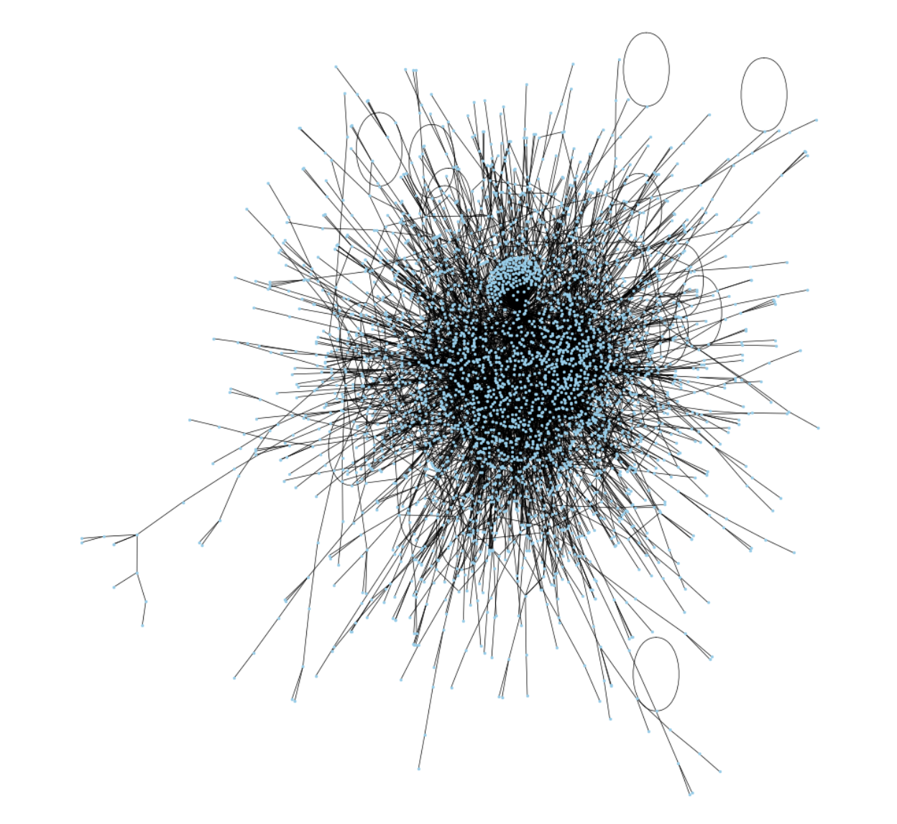

# Link-prediction-in-an-actor-co-occurrence-network
Predict the existence or non-existence of links between the nodes of an actor graph using ML and a Graph Auto-Encoder


**Visualization of the actor co-occurrence network.**

In this project, we are looking to predict the existence or non-existence of links between the nodes of an actor graph. The aim is to tell whether the two actors are on the same Wikipedia page (in which case the link exists) or whether this is not the case (no link). We have tried two methods. The first is based on classic machine learning, the second is a graph auto-encoder. However, only the first method gives satisfactory results, particularly when several different models are trained (XGBoost, Random Forest, logistical regression, etc.). In this report, we present our models and results.

For a detailed exploration of our methodologies, results, and discussions, refer to our comprehensive report: [Full Project Report](Final_Report.pdf)

## Files
- `ML.ipynb`: This provides a complete hands on approach to solve this challenge with Machine Learning methods.
- `GAE_final.py`: This is the main script where the GAE method is run.

You may want to run this command to effectively have the GAE model. 

```bash
python3 GAE_final.py
```


## How to Run
To run the project, execute the `GAE_final.py` script or play with the `ML.ipynb` notebook. Make sure you have the necessary dependencies installed.


## Dependencies

```bash
pip install -r requirements.txt
```

## Results
The model's performance is evaluated using the accuracy score from the sklearn library. The accuracy of the model before and after training is printed to the console. For the Machine Learning part, a promising accuracy of $76\%$ has been achieved.

## Future Work
Future improvements could include experimenting with different types of graph convolutional layers (such as GATConv), tuning the model's hyperparameters, or applying the model to different types of graph data.

## References
- [Thomas N. Kipf and Max Welling. Variational graph auto-encoders, 2016](https://arxiv.org/pdf/1611.07308.pdf)
- [Muhan Zhang. Graph Neural Networks: Link Prediction](https://graph-neural-networks.github.io/static/file/chapter10.pdf)

## Team
- Raphael Ferroni (raphael.romandferroni@student-cs.fr)
- Alexandre Selvestrel (alexandre.selvestrel@student-cs.fr)
